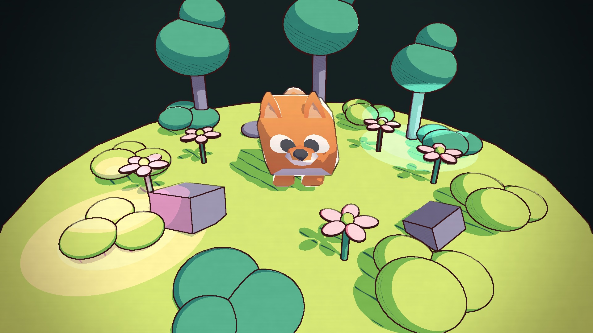
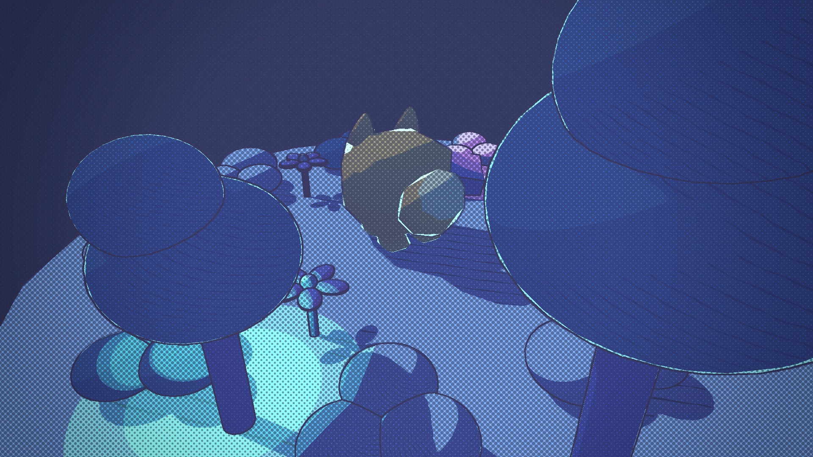

# HW 2: 3D Stylization — Clover Forest Clearing (with a bobbing fox)

| Day (paper style) | Night (press **Space**) |
|---|---|
|  |  |

**Turnaround video:** [Images/turnaround.mp4](Images/turnaround.mp4) (the style switches to the night print look halfway through)

---

## 1. Concept Art

Concept art by **stefscribbles** — <https://twitter.com/stefscribbles/status/1646235145110683650>

What I took from it:
- a lime / grass-green ground with deep **teal** foliage and dark corners
- **pink & white** accents (the bunny and flowers) that pop against the greens
- thick, slightly wobbly **dark purple outlines**
- small glowing fireflies — which I used as coloured point lights

---

## 2. Interesting Shaders

### Improved surface shader — `Assets/Shaders/Toon.shadergraph`
Built on the three-tone toon shader from the lab.

| Requirement | How |
|---|---|
| **Multiple light support** | `GetMainLight` gives the main light + shadow attenuation for the 3-tone ramp; `ComputeAdditionalLighting` (`LightingHelp.hlsl`) loops over all additional lights, ramps each one into hard toon bands and adds their colour. Keywords `_MAIN_LIGHT_SHADOWS`, `_MAIN_LIGHT_SHADOWS_CASCADE`, `_SHADOWS_SOFT`, `_ADDITIONAL_LIGHTS`, `_ADDITIONAL_LIGHT_SHADOWS` are multi-compile globals. The pink and cyan "firefly" point lights show this. |
| **Additional lighting feature** | **Rim highlight**: `Fresnel Effect` (power = `RimPower`) → `Step(0.5)` for a hard toon rim → × `RimColor`, added on top. |
| **Interesting shadow** | A custom seamless hatching texture (`Assets/Textures/ShadowHatch.png`, procedurally generated, tiles seamlessly) is sampled with the **object UVs** × an exposed **`ShadowScale`** float (per-material tiling control). Its value lerps between `Shadow` and `Midtone`, and that result feeds the shadow band, so the hatching follows the geometry instead of sticking to the screen. |
| **Accurate colour palette** | Separate materials per element using the concept palette: `Default` (lime ground), `ToonLeaf` (teal), `ToonRock` (purple-grey), `ToonFlower` (pink), `ToonBob` (white/pink hero). |

### Special surface shader — `Assets/Shaders/ToonBob.shadergraph` (Option 2: vertex animation)
A duplicate of the toon shader with a `BobVertex` custom function on the **Vertex Position** block:
- the object **bobs** up and down (`sin(t * Speed) * Amplitude`) and **sways** sideways with a phase that depends on height
- time is **stepped**: `t = floor(_Time.y * StepFPS) / StepFPS`, so it moves in a choppy, hand-animated way
- exposed `BobAmplitude`, `BobSpeed`, `BobStepFPS`

- the offset is built in **world space** (`mul((float3x3)GetWorldToObjectMatrix(), offsetWS)`), so every part of a multi-mesh model (body + 4 legs) bobs together
- **texture support**: a `BaseMap` texture (default white) multiplies the three-tone toon colour, so the textured hero keeps its own colours while still getting toon bands, rim, and multi-light
- the graph renders both faces, because the imported cube-pet meshes need it

It is used on the hero: a **Kenney cube-pet fox**, a little forest critter standing in the middle of the clearing.

---

## 3. Outlines — `Assets/Shaders/Outline.shader`

- **Full Screen Feature bug fix**: the pass only blitted *colour → temp* with the material and never copied the result back. Added `Blit(cmd, temporaryBuffer, colorBuffer);` so full-screen materials actually show up.
- **Normal buffer**: added the provided `NormalFeature` to `URP-Custom-Renderer` with a `NormalCopy` material and `Buffers/Normal Buffer` (1920×1080, same as the Game view) as the target. The depth buffer comes from URP's depth texture.
- **Edge detection**: Roberts Cross on **linear eye depth** (relative to the centre depth, so distant edges aren't over-detected) and on **view-space normals**. Adjustable `Thickness`, `DepthThreshold`, `NormalThreshold`, `OutlineColor`; there is also a debug "edges only" toggle.
- **Animated, hand-drawn look**: the **depth (silhouette) lines** are sampled at a UV offset from animated value noise whose time is stepped (`floor(_Time.y * WobbleFPS)`), so they "boil" a few times a second like hand-drawn animation. Line pressure is varied with another noise. The **normal (interior) lines stay still** so the drawing keeps its structure.
- **Animated objects**: vertex-animated objects can't appear correctly in the normal buffer (the override material doesn't run their vertex animation). They go on the **No Normal** layer, which is excluded from the normal pass. `Normal Copy.shader` now writes linear eye depth into the buffer's alpha, and the outline shader drops normal edges wherever something nearer covers that pixel, so no creases from behind show through the hero.

## 4. Full Screen Post Process — `Assets/Shaders/PaperPost.shader`

A second Full Screen Feature (`BeforeRenderingPostProcessing`):
- **colour grade**: a slight saturation change plus a warm paper tint
- **paper texture**: static multi-octave value-noise (fbm) grain plus faint horizontal fibres, multiplied over the image
- **coloured vignette**: an aspect-corrected `smoothstep` vignette tinted dark teal, like the dark corners of the concept art

## 5. Scene

`Assets/Scenes/Stylized Forest.unity`, built from primitives by an editor script (`Assets/Editor/BuildStylizedScene.cs`, menu **HW2 → Build Stylized Forest Scene**):
- a round clearing, clover bushes, trees, rocks and flowers
- the bobbing hero animal in the centre: Kenney **Cube Pets** fox (CC0, `Assets/Models/CubePets`). Seven other pets (bunny, cat, deer, chick, panda, penguin, koala) are included and can be swapped in with **HW2 → Hero Animal**
- a warm sun plus two coloured point-light "fireflies"
- the camera sits on a `Turntable` rig for the turnaround

## 6. Interactivity — `Assets/Scripts/StyleSwitcher.cs`

Press **Space** to toggle between **Day paper** and **Night print**:
- every toon material is swapped for a new **night-palette material**: `ToonNight`, `ToonLeafNight`, `ToonRockNight`, `ToonFlowerNight`, and `ToonPetNight` (night version of the hero)
- a global `_StyleMode` switches the post process to a **halftone print** effect: a rotated dot screen whose dot size follows luminance, on dark-blue paper with a stronger vignette

## Video

`Assets/Scripts/TurnaroundCapture.cs` + menu **HW2 → Record Turnaround** renders one full turn at a fixed 24 fps (toggling night mode in the middle). The frames were stitched with ffmpeg into `Images/turnaround.mp4` / `.gif`.

## Resources
- Concept art: stefscribbles (link above)
- Hero model: [Kenney — Cube Pets](https://kenney.nl/assets/cube-pets) (CC0)
- Lab / HW videos by Rachel and the CIS 5660 TAs; Robin Seibold's Roberts Cross outline tutorial; Alexander Ameye's edge-detection article; Cyanilux's depth article
