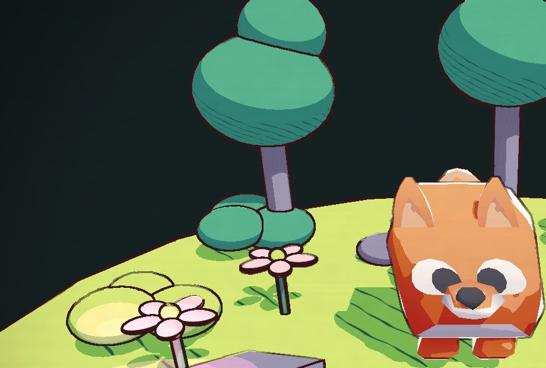
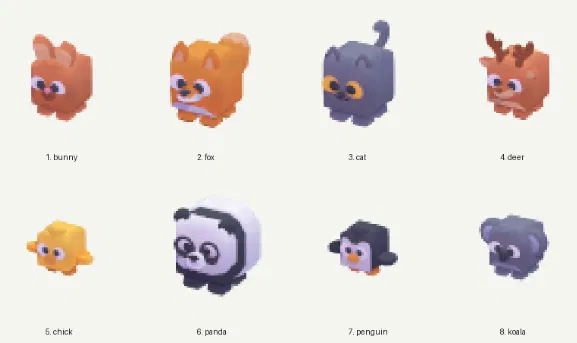

# HW 2: 3D Stylization

A tiny clover-forest clearing with a little fox bobbing in the middle! For this project I brought a storybook-style illustration into Unity with toon shading, hatched shadows, sketchy animated outlines and a painted-paper look. Press Space and the whole scene turns into a night-time halftone print.

[Full-quality turnaround video](Images/turnaround.mp4)

## Concept Art

I used this illustration by [stefscribbles](https://twitter.com/stefscribbles/status/1646235145110683650) as my reference for the colours and overall mood: lime-green ground, deep teal leaves, pink and white flowers, thick wobbly dark-purple outlines, dark corners, and little glowing fireflies.

## Improved Surface Shader

Starting from the three-tone toon shader from the lab, I added **multiple light support**: the sun and every point light are each broken into hard toon bands, and the pink and cyan "fireflies" show this off. I also added a crisp cartoon **rim light** on the edges of every object.

For the shadows I made a seamless, hand-drawn-looking **hatching texture**. It is sampled with the object's own UVs, so the lines wrap around each object instead of sticking to the screen, and a Shadow Scale slider controls how dense they are. Each object type (ground, leaves, rocks, flowers, hero) has its own material with colours picked from the concept art.

## Special Surface Shader

The fox gets a copy of the toon shader with **vertex animation**: it bobs up and down and sways gently from side to side. The motion is stepped, only a few poses per second, so it feels hand-animated rather than perfectly smooth. The offset is calculated in world space, so the body and all four legs move together. Amplitude, speed and frame rate are all adjustable on the material.

## Outlines

First I fixed the bug in the provided full-screen render feature, where the result was never copied back to the screen. Then I set up the normal buffer and detect edges from both **depth and normals** with a **Roberts Cross** filter, with adjustable thickness, thresholds and colour.

To match the sketchy outlines in the concept art, the outer silhouette lines **wobble with noise and "boil"** a few times per second, like hand-drawn animation, and their line weight varies a little. The inner crease lines stay still, so the shapes keep their structure. The bobbing fox is kept out of the normal buffer, and creases behind it are masked, so its movement doesn't cause double lines.

## Full Screen Post Process

A second full-screen pass makes every frame look painted on paper. It applies a soft warm colour grade, overlays a paper-grain texture made from layered noise with faint fibres, and adds a dark-teal vignette to echo the dark corners of the concept art.

## Scene

A round clearing with trees, clover bushes, rocks and flowers, lit by a warm sun and two coloured firefly lights. The camera slowly orbits for the turnaround. The hero is a cube-pet fox from Kenney, but the hero is **swappable**: in Unity, open the **HW2 → Hero Animal** menu and pick a bunny, fox, cat, deer, chick, panda, penguin or koala. The scene rebuilds automatically with the new animal in the middle, using the same bobbing shader and procedural colouring.

## Interactivity

**Press Space** to switch between **Day paper** and **Night print**. Every material swaps to a blue night palette, and the post process becomes a halftone dot pattern on dark-blue paper, like an old printed comic. Press Space again to return to day.

## Extra Credit: Texture Support with Procedural Colouring

The fox's texture isn't just darkened in shadow. Each toon band shifts its colour the way a painter would. Lit areas lean **warm** and slightly paler. Shadows lean **cool and violet** and get **more saturated**, so they stay rich and colourful instead of turning muddy brown. The steps line up exactly with the toon bands. The comparison below shows the plain texture on the left and procedural colouring on the right.

## Credits

- [Concept art by stefscribbles](https://twitter.com/stefscribbles/status/1646235145110683650)
- [Fox model from Kenney's Cube Pets (CC0)](https://kenney.nl/assets/cube-pets)
- References: the CIS 5660 lab and homework videos, Robin Seibold's outline tutorial, Alexander Ameye's article on edge-detection outlines, and Cyanilux's article on depth
