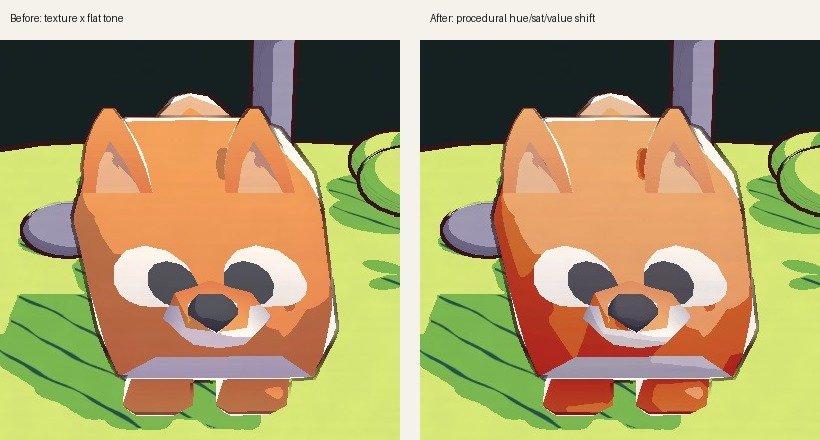

# HW 2: 3D Stylization — Clover Forest Clearing

A small clover-forest clearing in Unity URP: a bobbing cube-pet fox, toon shading with hatched shadows, animated hand-drawn outlines, a paper-texture post process, and a **Space**-key switch to a "night print" halftone style.

| Day (paper style) | Night (press **Space**) |
|---|---|
|  |  |

### Turnaround

Full-quality video: [Images/turnaround.mp4](Images/turnaround.mp4). The style switches to night mode partway through the turn.

---

## How to run
1. Open the project in **Unity 2022.3.9f1**.
2. Open `Assets/Scenes/Stylized Forest.unity` and press **Play**. The camera orbits the clearing automatically.
3. Press **Space** to toggle between **Day paper** and **Night print**.

The renderer features (normals, outline, post process) only run on the **Game** camera, so look at the Game view rather than the Scene view.

---

## 1. Concept Art

Concept art by **stefscribbles**: <https://twitter.com/stefscribbles/status/1646235145110683650>

What I took from it:
- a lime / grass-green ground with deep **teal** foliage, and dark corners
- **pink and white** accents (the flowers) that pop against the greens
- thick, slightly wobbly **dark purple outlines**
- small glowing fireflies, which became coloured point lights

---

## 2. Interesting Shaders

### Improved surface shader: `Assets/Shaders/Toon.shadergraph`
This is built on the three-tone toon shader from the lab.

| Requirement | Implementation |
|---|---|
| **Multiple light support** | `GetMainLight` gives the main light direction and shadow attenuation for the 3-tone ramp. `ComputeAdditionalLighting` (`Shaders/Includes/LightingHelp.hlsl`) loops over every additional light, ramps each one into hard toon bands, and adds its colour. The keywords `_MAIN_LIGHT_SHADOWS`, `_MAIN_LIGHT_SHADOWS_CASCADE`, `_SHADOWS_SOFT`, `_ADDITIONAL_LIGHTS` and `_ADDITIONAL_LIGHT_SHADOWS` are global multi-compile keywords. The pink and cyan "firefly" point lights show this. |
| **Additional lighting feature** | A **rim highlight**: `Fresnel Effect` (power = `RimPower`) → `Step(0.5)` for a hard toon rim → × `RimColor`, added on top. |
| **Interesting shadow** | A seamless hatching texture (`Assets/Textures/ShadowHatch.png`, procedurally generated so it tiles) is sampled with the **object UVs** × an exposed **`ShadowScale`** float, which gives per-material tiling control. The sample lerps between `Shadow` and `Midtone`, and the result is the colour of the shadow band, so the hatching follows the geometry instead of sticking to the screen. |
| **Accurate colour palette** | Each element has its own material in the concept palette: `Default` (lime ground), `ToonLeaf` (teal), `ToonRock` (purple-grey), `ToonFlower` (pink), and `ToonPet` (textured hero). |

### Special surface shader: `Assets/Shaders/ToonBob.shadergraph` (Option 2, vertex animation)
This is a duplicate of the toon shader with a `BobVertex` custom function on the **Vertex Position** block.
- The hero **bobs** up and down and **sways** sideways, with a sway phase that depends on height.
- Time is **stepped** (`t = floor(_Time.y * StepFPS) / StepFPS`), so the motion is choppy like hand-drawn animation.
- The offset is built in **world space** and converted back with `mul((float3x3)GetWorldToObjectMatrix(), offsetWS)`, so every part of a multi-mesh model (body plus four legs) moves together.
- Exposed parameters: `BobAmplitude`, `BobSpeed`, `BobStepFPS`.
- **Texture support**: a `BaseMap` texture (white by default) multiplies the three-tone colour. The textured fox keeps its own colours and still gets toon bands, rim light and multiple lights.
- The graph renders both faces, because the imported cube-pet meshes need it.

It is used on the hero, a **Kenney cube-pet fox** standing in the middle of the clearing.

---

## 3. Outlines: `Assets/Shaders/Outline.shader`

- **Full Screen Feature bug fix.** The pass blitted *color → temp* with the material but never copied the result back. Adding `Blit(cmd, temporaryBuffer, colorBuffer);` makes full-screen materials show up.
- **Depth and normal buffers.**
  - I added the provided `NormalFeature` to `URP-Custom-Renderer`. It uses a `NormalCopy` material and writes to `Buffers/Normal Buffer`, which is 1920×1080, the same as the Game view.
  - Depth comes from URP's camera depth texture.
- **Edge detection.**
  - **Roberts Cross** runs on linear eye depth and on view-space normals. The depth test is relative to the centre depth, so distant edges aren't over-detected.
  - Adjustable parameters: `Thickness`, `DepthThreshold`, `NormalThreshold`, `OutlineColor`, plus a debug "edges only" toggle.
- **Animated, hand-drawn look.**
  - The **depth (silhouette) lines** are sampled at a UV offset taken from animated value noise. Its time is stepped (`floor(_Time.y * WobbleFPS)`), so the lines "boil" a few times a second like hand-drawn animation.
  - A second noise varies the line pressure.
  - The **normal (interior) lines stay still**, so the drawing keeps its structure, as in the example in the assignment.
- **Vertex-animated objects.**
  - The normal pass uses an override material, so it can't reproduce the hero's vertex animation. The hero therefore goes on the **No Normal** layer, which the normal pass excludes.
  - `Normal Copy.shader` now also writes linear eye depth into the buffer's alpha. The outline shader drops normal edges wherever a nearer surface covers the pixel, so creases from behind the hero don't show through it.

## 4. Full Screen Post Process: `Assets/Shaders/PaperPost.shader`

This is a second Full Screen Feature, running at `BeforeRenderingPostProcessing`:
- **Colour grade:** a small saturation change plus a warm paper tint.
- **Paper texture:** static multi-octave value noise (fbm) for grain, plus faint horizontal fibres, multiplied over the image.
- **Coloured vignette:** an aspect-corrected `smoothstep` vignette tinted dark teal, like the dark corners of the concept art.

## 5. Scene

The scene is `Assets/Scenes/Stylized Forest.unity`. An editor script assembles it (`Assets/Editor/BuildStylizedScene.cs`, menu **HW2 → Build Stylized Forest Scene**):
- a round clearing with clover bushes, trees, rocks and flowers
- the bobbing hero in the centre, the **Kenney Cube Pets fox** (CC0, `Assets/Models/CubePets`). Seven other pets are included (bunny, cat, deer, chick, panda, penguin, koala) and can be swapped in with **HW2 → Hero Animal**.
- a warm directional sun plus two coloured point-light "fireflies"
- a camera on a `Turntable` rig for the turnaround

## 6. Interactivity: `Assets/Scripts/StyleSwitcher.cs`

Press **Space** to switch between **Day paper** and **Night print**:
- Every toon material is swapped for a new **night-palette material**: `ToonNight`, `ToonLeafNight`, `ToonRockNight`, `ToonFlowerNight` and `ToonPetNight`.
- A global shader value, `_StyleMode`, switches the post process to a **halftone print** effect. It draws a rotated dot screen whose dot size follows luminance, on dark-blue paper with a stronger vignette.

## 7. Extra Credit: Texture Support with Procedural Colouring

The hero shader (`ToonBob`) supports a `BaseMap` texture. Its toon shading does **not** just multiply the texture by a darker grey. The custom function `ProceduralTint` (`Assets/Shaders/Includes/ProceduralColor.hlsl`) converts the texture colour to **HSV** and changes it per toon band, the way a painter picks lit and shadow colours:

| Band | Hue | Saturation | Value |
|---|---|---|---|
| Highlight | shifts slightly **warm** (toward yellow) | a little **lower** (light washes colour out) | slightly brighter |
| Midtone | about halfway between the other two bands | unchanged | slightly darker |
| Shadow | shifts **cool** (toward violet) | **higher**, so shadows stay rich instead of going grey-brown | darker |

The band comes from the same main-light diffuse value and thresholds as the three-tone ramp, so the colour steps line up exactly with the toon bands. The result is then lightly tinted by the material's `Highlight/Midtone/Shadow` colours, which is how the night-mode material recolours the fox. The image above compares *before* (texture × flat tone) with *after* (procedural hue, saturation and value shift).

## Recording the video
`Assets/Scripts/TurnaroundCapture.cs` with the menu item **HW2 → Record Turnaround** renders one full turn at a fixed 24 fps and switches to night mode partway through. I stitched the frames into `Images/turnaround.mp4` and `.gif` with ffmpeg.

## Known limitations
- The hero is on the No Normal layer, so its outline comes only from the depth edges. It is thinner than the other outlines where the fox stands right in front of the ground.

## Credits
- Concept art: **stefscribbles** (link above)
- Hero model: [Kenney, Cube Pets](https://kenney.nl/assets/cube-pets) (CC0)
- References: the CIS 5660 lab and HW videos, Robin Seibold's Roberts Cross outline tutorial, Alexander Ameye's article on edge-detection outlines, and Cyanilux's article on depth
